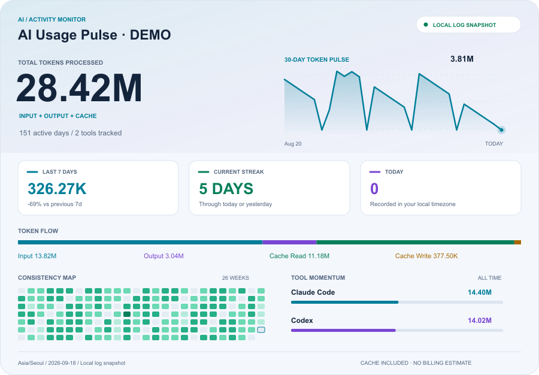

# AI Usage Pulse

[English](README.en.md) · 한국어

Codex, Claude Code, Gemini CLI 등 로컬 AI 사용 기록을 분석해 GitHub 프로필용 SVG 대시보드를 만듭니다. 여러 컴퓨터의 장치별 원장을 하나로 합치며, Python 3.10+ 표준 라이브러리만 사용하고 수집 중 외부 API를 호출하지 않습니다.

<picture>
  <source media="(prefers-color-scheme: dark)" srcset="./previews/dashboard-dark.png">
  <source media="(prefers-color-scheme: light)" srcset="./previews/dashboard-light.png">
  
</picture>

## 카드 디자인

네온 포인트, 30일 추이 그래프, 최근 7일 대비 증감률, 연속 활동일, 오늘 사용량, 도구별 사용 비중을 표시합니다. 연속 활동일은 오늘 또는 어제까지 이어지는 기록을 기준으로 합니다. 최근 7일에는 아직 끝나지 않은 오늘도 포함됩니다.

SVG에는 그래프 등장 및 상태 점의 은은한 CSS 애니메이션이 포함되어 있습니다. 모션 감소 설정을 존중하며 애니메이션을 지원하지 않는 뷰어에서는 정적으로 표시됩니다. GitHub 게시 후의 애니메이션 동작은 아직 확인하지 않았습니다. 카드 숫자는 생성 시점의 스냅샷이며 실시간 갱신을 의미하지 않습니다.

## 크기 선택

실행할 때 아래 7종을 라이트·다크 테마로 모두 생성합니다(총 14개 SVG). `dashboard`와 `combo`는 같은 전체 대시보드를 서로 다른 파일명으로 제공합니다.

| 레이아웃 | 크기 | 파일명 (`THEME`은 `dark` 또는 `light`) |
| --- | --- | --- |
| dashboard | 900 × 626 이상 | `ai-usage-THEME.svg` |
| full | 846 × 225 | `ai-usage-full-THEME.svg` |
| combo | 900 × 626 이상 | `ai-usage-combo-THEME.svg` |
| compact | 846 × 195 | `ai-usage-compact-THEME.svg` |
| half | 423 × 195 | `ai-usage-half-THEME.svg` |
| grass | 423 × 195 | `ai-usage-grass-THEME.svg` |
| half-grass | 423 × 335 | `ai-usage-half-grass-THEME.svg` |

기존 대시보드의 큰 숫자·네온 포인트·30일 추이 그래프를 각 크기에 맞춰 재구성했습니다.

- `full`: 큰 누적 숫자, 넓은 추이 그래프, 최근 사용량 패널, 토큰 구성 칩.
- `combo`: 큰 숫자, 30일 추이, 지표 타일, 토큰 구성, 활동 잔디를 모두 담은 전체 대시보드. 기본값.
- `compact`: 누적 숫자 → 추이 그래프 → 활동 잔디 패널의 가로 구성.
- `half`: 숫자와 스파크라인, 하단의 이번 주·오늘·활동일 통계.
- `grass`: 활동일 숫자, 30일 추이, 26주 잔디를 합친 활동 카드.
- `half-grass`: 숫자·그래프·통계 타일·잔디를 담은 세로 미니 대시보드.

기존 파일명과 크기를 유지하므로 README 링크는 그대로 사용할 수 있습니다. 도구별 상세 분석은 기본 대시보드와 JSON에서 확인할 수 있습니다.

실행 후 출력 폴더에 생성되는 `README-snippet.md`에서 원하는 레이아웃의 블록을 복사할 수 있습니다. `half` + `grass`를 나란히 배치하는 코드도 포함됩니다.

## 지원 범위

모든 도구의 데이터를 받을 수 있는 공통 가져오기 형식을 지원합니다. **모든 AI 제품에 대한 자동 연동을 제공한다는 뜻은 아닙니다.**

| 도구 | 수집 방식 | 상태 |
| --- | --- | --- |
| Codex CLI / 데스크톱의 로컬 세션 | `$CODEX_HOME/sessions`, `archived_sessions` JSONL | 실제 로컬 로그 검증 |
| Claude Code | `$CLAUDE_CONFIG_DIR/projects` JSONL | 실제 로컬 로그 검증 |
| Gemini CLI | `~/.gemini/tmp/*/chats/session-*.json`, `.jsonl` | 공식 스키마 기반, 합성 데이터 검증 |
| Cursor, GitHub Copilot, Windsurf, OpenCode, Cline, Roo Code, Aider 등 | 사용량 내보내기/API 응답을 아래 공통 JSON으로 변환 | 공통 importer 제공, 제품별 자동 변환기 미구현 |
| ChatGPT, Claude, Gemini 웹 및 기타 제품 | 토큰 수를 제공하는 내보내기/API가 있을 때 공통 JSON으로 변환 | 토큰 수가 없는 대화 기록만으로 정확한 집계 불가 |

요청 횟수, 크레딧, 이용 한도 퍼센트를 토큰으로 환산하지 않습니다. API와 클라이언트 양쪽에 같은 요청이 기록된 경우 하나의 소스만 선택해야 합니다.

## 실행

```sh
python3 src/usage_card.py --device macbook-home --title "My AI Coding Usage"
```

`--device`는 컴퓨터마다 겹치지 않는 영구 ID입니다. 예: `macbook-home`, `macbook-work`, `desktop`. 한 번 사용한 ID는 나중에 바꾸지 않는 것이 좋습니다. 생략하면 `USAGE_CARD_DEVICE` 환경변수, 그마저 없으면 현재 hostname을 사용합니다.

특정 도구만 수집하려면 별도 원장을 지정합니다.

```sh
python3 src/usage_card.py --tools codex --device macbook --state-dir .usage-state/codex-devices
python3 src/usage_card.py --tools gemini --device macbook --state-dir .usage-state/gemini-devices
```

`--codex-home`, `--claude-home`, `--gemini-home`으로 경로를 변경할 수 있습니다. 날짜 기준은 기본 `Asia/Seoul`이며 `--timezone`으로 변경합니다. 같은 장치 원장 폴더에 서로 다른 시간대나 `--tools` 설정을 혼합하지 않습니다. 이전 버전의 `.usage-state/ledger.json`은 첫 실행 시 현재 장치 원장으로 자동 복사됩니다.

샘플 미리보기는 별도 출력 경로에 생성합니다. 실제 사용 원장에는 반영되지 않습니다.

```sh
python3 src/usage_card.py --demo --output /tmp/ai-usage-demo
```

## 모든 도구의 사용량 가져오기

[예제 JSON](examples/import-usage.json)을 참고해 제품의 사용량 내보내기/API 데이터를 변환합니다. 예제의 숫자는 가상 데이터입니다.

```sh
python3 src/usage_card.py --import-json /path/to/cursor-normalized.json --import-json /path/to/copilot-normalized.json
# 로컬 로그 없이 가져온 데이터만 사용
python3 src/usage_card.py --tools imports --device macbook --import-json /path/to/usage.json --state-dir .usage-state/import-devices
```

각 레코드는 `source`, `id`, `tool`, `model`, 시간대가 포함된 `timestamp`, 그리고 다음 네 개의 **서로 중복되지 않는** 정수 필드가 필요합니다.

| 필드 | 의미 |
| --- | --- |
| `input` | 캐시 읽기/쓰기를 제외한 입력 토큰 |
| `output` | 출력 토큰, reasoning이 별도 제공되는 제품은 이를 포함 |
| `cache_read` | 캐시에서 읽은 입력 토큰 |
| `cache_write` | 캐시에 기록한 입력 토큰 |

`source + tool + id`는 한 요청의 고정 식별자입니다. 동일 요청을 다시 가져오면 중복 합산하지 않습니다. 일별 합계 데이터라면 `id`를 `날짜+모델`로 고정하고, 서로 겹치는 기간 합계를 넣지 마세요. 여러 계정/컴퓨터는 서로 다른 `source`를 사용합니다. 같은 요청을 다른 소스명으로 가져오거나 자동 수집 로그와 중복해서 가져오면 중복 집계됩니다.

## GitHub 프로필에 적용

1. 저장소를 clone합니다.

```sh
git clone https://github.com/92pino/ai-usage-pulse.git
cd ai-usage-pulse
```

2. GitHub에 로그인합니다.

```sh
gh auth login
```

3. 이 컴퓨터의 이름을 정해 최초 설정을 실행합니다.

```sh
./setup.sh macbook-home
```

컴퓨터 이름은 `macbook-home`, `work-macbook`, `desktop`처럼 자유롭게 정할 수 있습니다. 설정이 끝나면 GitHub 프로필 README에 카드가 자동으로 등록됩니다.

4. 이후 사용량을 갱신할 때 실행합니다.

```sh
./update.sh
```

`update.sh`가 로그 수집, 여러 컴퓨터 사용량 병합, SVG 생성, commit, push를 모두 처리합니다.

## 여러 컴퓨터에서 하나의 카드 갱신

각 컴퓨터에서 이 저장소를 clone하고 서로 다른 이름으로 설정합니다.

```sh
# 첫 번째 컴퓨터
./setup.sh macbook-home

# 두 번째 컴퓨터
./setup.sh work-desktop
```

그다음부터는 어느 컴퓨터에서든 동일합니다.

```sh
./update.sh
```

최초 설정 시 `GitHub사용자명/ai-usage-pulse-data` 비공개 저장소가 자동 생성됩니다. 장치 원장은 이 비공개 저장소에서 합쳐지고, 공개 프로필 저장소에는 선택한 라이트·다크 SVG와 README 블록만 올라갑니다. 프롬프트, 코드, 요청 식별자, 모델별 원장은 공개되지 않습니다.

같은 장치 이름을 두 컴퓨터에서 사용하면 원장이 섞일 수 있으므로 각 컴퓨터마다 고유한 이름을 사용하세요. 두 컴퓨터의 자동 실행 시간은 몇 분씩 다르게 설정하는 것이 좋습니다.

## 집계 원칙과 제한

- 전체 토큰, 최근 30일, 활동일 수, 입력/출력/캐시 구성, 26주 잔디, 도구별 합계가 표시됩니다. 도구가 많으면 카드 높이가 늘어납니다. JSON에는 일별·모델별 분석도 포함됩니다.
- Codex의 누적 카운터에서 증분을 계산합니다. 캐시 입력과 reasoning 출력은 이미 포함된 필드에 다시 더하지 않습니다. 동일 세션의 카운터가 감소하는 로그는 진단에 표시하며, 이후 기존 최대치를 초과하는 부분만 집계합니다.
- Claude Code는 메시지 ID 기준으로 스트리밍 업데이트를 병합합니다. Gemini는 메시지 ID 기준으로 병합하고, 별도 thoughts를 출력에 포함합니다.
- 기본적으로 `.usage-state/devices/<device>.json`에 장치별 해시 식별자와 숫자 원장을 저장합니다. 모든 장치 원장을 합칠 때 같은 해시는 한 번만 계산합니다. 이미 집계한 로그 파일이 삭제되어도 기록을 유지하며, 원장 파일을 지우면 해당 장치의 보존 기록이 사라집니다.
- 수집 이전에 삭제된 로그는 복구하지 못합니다. Codex 로그 파일의 앞부분만 잘린 경우나 포크 세션에 과거 사용량이 복제된 경우에는 정확도가 제한될 수 있습니다. 청구서가 아니라 **현재 읽을 수 있는 로그에 기반한 분석**입니다.
- 구독료/API 비용은 추정하지 않습니다. 캐시를 포함한 토큰 수이므로 비용과 비례하지 않습니다.
- 카드와 분석 JSON에는 프롬프트·응답·코드·프로젝트 경로를 쓰지 않습니다. 날짜별 사용량, 모델명, 도구명은 포함되므로 공개할 내용을 선택하세요. 프로필에는 SVG 두 파일만으로 충분합니다.
- 잘못된 JSONL 줄은 진단 카운트에 기록하고 건너뜁니다. 파일을 읽을 수 없으면 저장하지 않고 실패합니다. 읽는 동안 작성 중인 마지막 줄은 다음 실행에서 다시 읽습니다.

## 검증

```sh
python3 -m unittest discover -s tests -v
```

중복 이벤트/복사 로그, 캐시 및 reasoning 중복 방지, 원장 유지, 한국 시간 날짜 변환, Gemini JSON/JSONL, 외부 데이터 검증, 빈 데이터 및 다수 도구의 SVG XML을 테스트합니다.

## 참고

Gemini 형식은 [공식 chatRecordingService](https://github.com/google-gemini/gemini-cli/blob/main/packages/core/src/services/chatRecordingService.ts)를 참고했습니다. GitHub Copilot은 [공식 usage metrics](https://docs.github.com/en/copilot/reference/copilot-usage-metrics/copilot-usage-metrics)의 제공 범위와 계정 권한을 확인한 뒤 공통 형식으로 변환해야 합니다.
